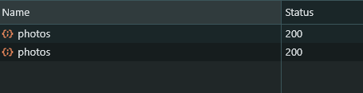
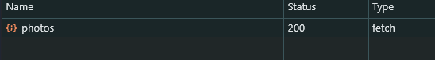

## Call API in the Traditional Way

- For example, we have an API to fetch photos. Traditionally, we would create a useState. Then we would use fetch to call the API and set the state for photos.

```tsx
import React, { useEffect, useState } from "react";

type Photo = {
  albumId: number;
  id: number;
  title: string;
  url: string;
  thumbnailUrl: string;
};

const Photos = () => {
  const [photos, setPhotos] = useState<Photo[]>([]);

  useEffect(() => {
    fetch("https://jsonplaceholder.typicode.com/photos")
      .then((response) => response.json())
      .then((data) => setPhotos(data));
  }, []);

  return (
    <div>
      {photos.map((photo) => (
        
      ))}
    </div>
  );
};
```

- With this approach, the API will be called twice because of strict mode.
  

## Using SWR

- **SWR** is a React Hook for remote data fetching. With SWR, we don't need to worry about state management, it automatically handles state for us. Even in strict mode, the API is called only once. It also supports **cache**, revalidation, focus tracking, refetching, pagination, and more.
- Cache scenario: Suppose we have 2 components calling the same API, it will be called only once, and the cache will be used for the other component.

```tsx
import useSWR from "swr";

const fetcher = (url: string) => fetch(url).then((res) => res.json());

const Photos = () => {
  const { data: photos } = useSWR<Photo[]>("https://jsonplaceholder.typicode.com/photos", fetcher);

  return (
    <div>
      {photos?.map((photo) => (
        
      ))}
    </div>
  );
};
```



- If there is a component in that file also using the API, the API in the network tab will be called a total of only once.

```tsx
const ABC = () => {
  const { data: photos, error } = useSWR<PhotoType[]>(
    "https://jsonplaceholder.typicode.com/photos",
    fetcher
  );
  return <p>ABC</p>;
};
```
