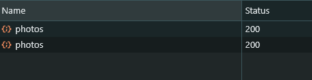

## Gọi api bằng cách thông thường

- VD: ta có 1 api để lấy ra các photos, với cách thông thường ta sẽ tạo 1 useState. Sau đó sẽ dùng fetch để gọi api và set state cho photos.

```tsx
import React, { useEffect, useState } from "react";

type Photo = {
  albumId: number;
  id: number;
  title: string;
  url: string;
  thumbnailUrl: string;
};

const Photos = () => {
  const [photos, setPhotos] = useState<Photo[]>([]);

  useEffect(() => {
    fetch("https://jsonplaceholder.typicode.com/photos")
      .then((response) => response.json())
      .then((data) => setPhotos(data));
  }, []);

  return (
    <div>
      {photos.map((photo) => (
        
      ))}
    </div>
  );
};
```

- Với cách này thì api sẽ gọi 2 lần, bởi vì strict mode
  

## Sử dụng swr

- **SWR** là một React Hooks cho remote data fetching. Với việc sử dụng SWR, chúng ta không cần phải quan tâm đến việc quản lý state, nó sẽ tự động quản lý state cho chúng ta. Và kể cả có đang ở trong strict mode thì api cũng chỉ gọi 1 lần. Và nó còn hỗ trợ **cache**, revalidation, focus tracking, refetching, pagination, and more.
- Trường hợp **cache**: giả dụ ta có 2 component cùng gọi đến api này, nó sẽ chỉ gọi 1 lần, và sử dụng cache cho component còn lại.

```tsx
import useSWR from "swr";

const fetcher = (url: string) => fetch(url).then((res) => res.json());

const Photos = () => {
  const { data: photos } = useSWR<Photo[]>("https://jsonplaceholder.typicode.com/photos", fetcher);

  return (
    <div>
      {photos?.map((photo) => (
        
      ))}
    </div>
  );
};
```


- Nếu trong file đó có 1 component cũng dùng api thì api trong tab network nó cũng chỉ call tổng cộng là 1 lần

```tsx
const ABC = () => {
  const { data: photos, error } = useSWR<PhotoType[]>(
    "https://jsonplaceholder.typicode.com/photos",
    fetcher
  );
  return <p>ABC</p>;
};
```
